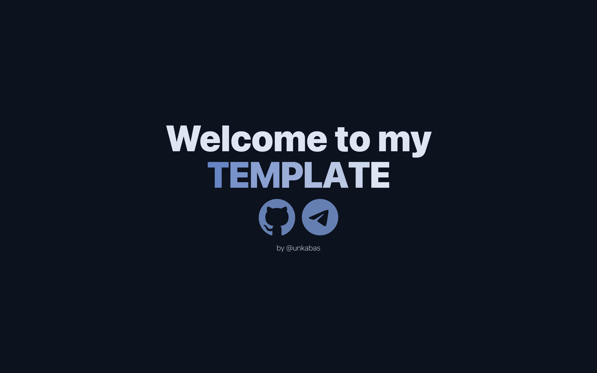

# unbas/template-vite-ts-tw

A minimal template for React + TypeScript + Tailwind CSS projects powered by Vite and Bun.



## Features

- **React** for building UI.
- **TypeScript** for static typing.
- **Tailwind CSS** for utility-first styling.
- **Vite** for fast development and build.
- **Bun** for speedy runtime, bundler, and package management.
- Adaptive design with CSS `clamp()` support.
- SVG icon support.

## Installation

> **Note:** Make sure you have [Bun](https://bun.sh/) installed.

Clone the repository and install dependencies:

```bash
git clone https://github.com/unbas/template-vite-ts-tw.git
cd template-vite-ts-tw
bun install
```
